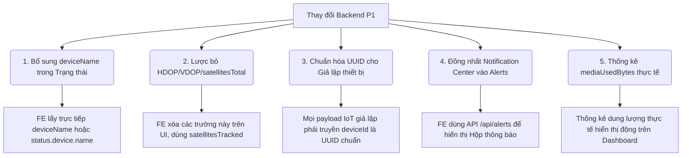

# 📝 Báo Cáo Thay Đổi Hợp Đồng API & Hướng Dẫn Tích Hợp Cho Frontend (FE)

Tài liệu này tổng hợp toàn bộ các thay đổi ở phía Backend (NestJS) sau đợt cập nhật các tính năng ưu tiên P1. Các thay đổi này giúp Frontend đơn giản hóa luồng code, tối ưu giao diện và kiểm soát chặt chẽ dữ liệu mô phỏng.

---

## 📌 Các Điểm Thay Đổi Chính & Hướng Dẫn Cho Frontend



### 1. Bổ sung `deviceName` trực tiếp trong Trạng thái Thiết bị (Rất tiện lợi cho FE)
* **Thay đổi từ Backend**:
  * Khi gọi API truy cập danh sách thiết bị của tôi (`GET /api/device-status/mine`), Backend đã thực hiện liên kết cơ sở dữ liệu (`LEFT JOIN`) để trả về trực tiếp trường `deviceName` ở cấp ngoài cùng của JSON object.
  * Khi gọi API xem tất cả trạng thái (`GET /api/device-status`) hoặc chi tiết theo thiết bị (`GET /api/device-status/device/:deviceId`), Backend thực hiện eager-load quan hệ để đính kèm object `device` (chứa `name`, `ownerId`...).
* **Hành động của FE**: 
  * Bạn có thể sử dụng ngay trường `deviceName` hoặc `status.device.name` để hiển thị tên thiết bị lên danh sách giám sát trạng thái thời gian thực mà **không cần** tự viết code đối chiếu thủ công (lookup mapping) giữa danh sách Devices và danh sách DeviceStatus như trước nữa.

---

### 2. Lược bỏ các trường địa lý không cần thiết (`hdop`, `vdop`, `satellitesTotal`)
* **Thay đổi từ Backend**: Theo thống nhất nghiệp vụ và để giảm tải băng thông gói tin IoT, Backend **không sử dụng** và **không trả về** các trường `hdop`, `vdop` và `satellitesTotal`.
* **Hành động của FE**: 
  * Gỡ bỏ các ô hiển thị HDOP, VDOP trên giao diện bản đồ hoặc bảng điều khiển.
  * Hiển thị số lượng vệ tinh duy nhất qua trường **`satellitesTracked`** (có sẵn trong Trạng thái thiết bị `deviceStatus`).

---

### 3. Ràng buộc nghiêm ngặt dữ liệu của Bộ giả lập Thiết bị (IoT Simulator)
* **Thay đổi từ Backend**: Backend đã tích hợp bộ xác thực dữ liệu đầu vào nghiêm ngặt (`PayloadValidator` và class-validator DTOs). Nếu bất kỳ tham số nào sai kiểu dữ liệu hoặc sai định dạng, gói tin di chuyển/trạng thái từ thiết bị gửi lên qua MQTT/Kafka sẽ bị Backend từ chối ngay lập tức.
* **Hành động của FE (Nếu có trang Mô phỏng thiết bị hoặc gửi tọa độ ảo)**:
  * **Định dạng `deviceId`**: Bắt buộc phải là chuỗi định dạng **UUID hợp lệ** (Ví dụ: `019e4a45-b4aa-74ed-b5c2-484b89b18701`). Nếu truyền chuỗi tùy tiện dạng chữ như `device-01` hay `thietbi-abc`, Backend sẽ báo lỗi validation và vứt bỏ gói tin.
  * **Các giá trị số thực**: Đảm bảo các trường `lat` (vĩ độ), `lng` (kinh độ), `speed` (vận tốc), `heading` (hướng di chuyển) phải gửi lên dạng số thực (`number`), không được bao trong chuỗi string (không viết `"speed": "45"` mà phải viết `"speed": 45`).

---

### 4. Đồng nhất Hộp thư thông báo (Notification Center) vào hệ thống Alerts
* **Giải pháp thiết kế**: Để tránh dư thừa dữ liệu và đơn giản hóa giao diện, Backend **không xây dựng** bảng `notifications` riêng lẻ. Toàn bộ tính năng thông báo in-app đều chạy trên nền tảng **Alerts Module**:
  * **Thông báo realtime**: Khi có cảnh báo mới (quá tốc độ, vi phạm hàng rào...), Backend sẽ broadcast qua WebSocket. FE chỉ cần bắt sự kiện này để hiển thị Toast thông báo.
  * **Hộp thư lịch sử**: Sử dụng trực tiếp API của Alerts để làm màn hình Notification Center (Hộp thư thông báo).
* **Hành động của FE**:
  * Gọi API `GET /api/alerts` (hoặc `GET /api/alerts/device/:deviceId`) để kết xuất danh sách thông báo.
  * Để đánh dấu thông báo đã đọc/đã xử lý, gọi API: `PATCH /api/alerts/:id/resolve`.

---

### 5. Thống kê dung lượng lưu trữ (`mediaUsedBytes`) đã chạy thực tế
* **Thay đổi từ Backend**: Tại API thống kê Dashboard (`GET /api/dashboard/stats`), trường `mediaUsedBytes` không còn trả về số cứng `0` (dữ liệu mock) nữa. Backend đã chạy câu lệnh tính tổng dung lượng thực tế của các file ảnh/video do chính user đăng nhập sở hữu.
* **Hành động của FE**: Giữ nguyên binding trường `mediaUsedBytes` trên Dashboard, dữ liệu hiển thị bây giờ đã tự động cập nhật chính xác dung lượng lưu trữ thực tế trên S3/SeaweedFS.

---

## 📋 Mẫu Payload Chuẩn cho Giả lập thiết bị (MQTT/Kafka)

Nếu bạn có chạy Client IoT mô phỏng bằng JavaScript hoặc Python, hãy đảm bảo cấu trúc gói tin gửi lên khớp chính xác với DTO dưới đây để tránh bị Backend từ chối:

### 1. Kênh gửi Tọa độ di chuyển (`gnss/<deviceId>/coordinates`):
```json
{
  "deviceId": "019e4a45-b4aa-74ed-b5c2-484b89b18701",
  "lng": 105.8048,
  "lat": 21.0285,
  "speed": 45.5,
  "heading": 180,
  "timestamp": "2026-05-27T10:00:00.000Z"
}
```

### 2. Kênh gửi Trạng thái thiết bị (`gnss/<deviceId>/status`):
```json
{
  "deviceId": "019e4a45-b4aa-74ed-b5c2-484b89b18701",
  "status": "online", 
  "batteryLevel": 85,
  "cameraStatus": true,
  "gnssStatus": true,
  "satellitesTracked": 12,
  "signalStrength": 90
}
```
*(Trường `status` chỉ chấp nhận các giá trị: `online`, `offline`, hoặc `maintenance`)*.
