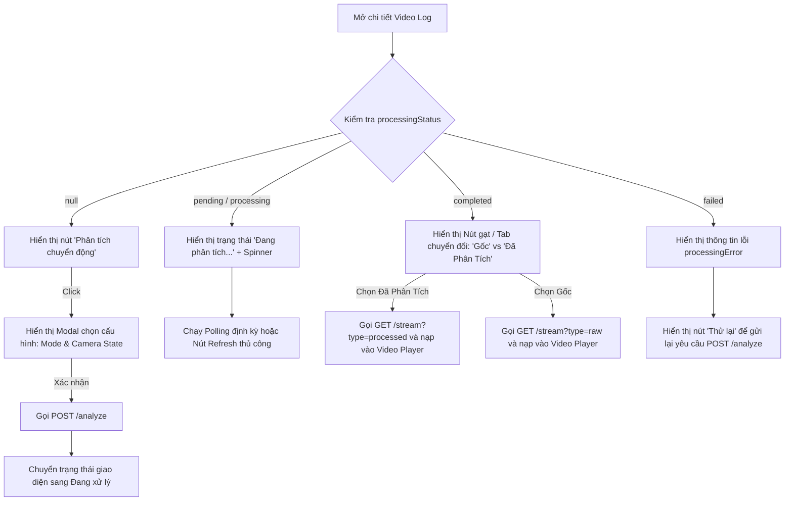

# Kế hoạch Tích hợp Frontend (FE) - Phân tích Chuyển động (Optical Flow AI)

Tài liệu này hướng dẫn cách Frontend tích hợp các tính năng mới của **Optical Flow AI Processing** từ backend. Tính năng này cho phép phân tích chuyển động video hành trình của thiết bị, tạo ra video kết quả hiển thị Vector chuyển động hoặc Heatmap chuyển động.

---

## 🗺️ 1. Tổng quan Luồng Tích hợp trên FE

1. **Hiển thị trạng thái phân tích**: Khi xem chi tiết một Video Log, FE kiểm tra trường trạng thái `processingStatus`.
2. **Kích hoạt Phân tích**: Nếu video chưa được xử lý (hoặc bị lỗi), FE cung cấp nút bấm để kích hoạt API Phân tích (`POST /media-logs/:id/analyze`).
3. **Theo dõi tiến trình**: Trong lúc xử lý (`pending` hoặc `processing`), hiển thị trạng thái chờ và có thể thực hiện cơ chế cập nhật tự động (polling) hoặc cung cấp nút tải lại (reload).
4. **Phát Video kết quả**: Khi trạng thái xử lý đạt `completed`, FE hiển thị tùy chọn chuyển đổi (toggle) giữa **Video Gốc** và **Video Đã Phân Tích**, sau đó gọi API lấy luồng tương ứng để phát trên player.

---

## 🗄️ 2. Các thay đổi trong Mô hình Dữ liệu (Data Model)

Thực thể [MediaLog](file:///root/gnss-system/src/modules/media-logs/entities/media-log.entity.ts) được bổ sung 3 trường dữ liệu mới phục vụ cho AI:

| Thuộc tính mới | Kiểu dữ liệu | Mô tả |
| :--- | :--- | :--- |
| **`processingStatus`** | `'pending' \| 'processing' \| 'completed' \| 'failed' \| 'cancelled' \| null` | Trạng thái xử lý AI hiện tại. `null` nghĩa là chưa từng chạy phân tích. |
| **`processedS3Key`** | `string \| null` | Khóa đối tượng S3 của video kết quả phân tích AI. Chỉ khả dụng khi trạng thái là `'completed'`. |
| **`processingError`** | `string \| null` | Chi tiết lỗi phân tích từ AI worker nếu trạng thái là `'failed'`. |

---

## 📡 3. Chi tiết API Tích hợp

### 🚀 A. Kích hoạt Phân tích AI (`POST /media-logs/:id/analyze`)

Gửi yêu cầu đến backend để kích hoạt worker AI xử lý video qua hàng đợi Kafka.

*   **URL:** `/api/media-logs/:id/analyze`
*   **Method:** `POST`
*   **Headers:** `Content-Type: application/json` (Yêu cầu Session Cookie đã được xác thực)
*   **URL Params:** `id` (UUID của Media Log)
*   **Request Body (JSON):**

```json
{
  "mode": "VECTORS",   // Tùy chọn: "VECTORS" (vẽ mũi tên chuyển động) hoặc "HEATMAP" (bản đồ nhiệt chuyển động). Mặc định: "VECTORS"
  "isMoving": true    // Tùy chọn: true (camera đang di chuyển, vd trên xe) hoặc false (camera tĩnh cố định). Mặc định: true
}
```

*   **Phản hồi thành công (201 Created):**

```json
{
  "jobId": "2d1b8c22-0ff2-4c3e-8a1f-ef079c6d59b2",
  "status": "pending"
}
```

> [!WARNING]
> API này chỉ hỗ trợ các Media Log có `mediaType` là `'video_chunk'`. Nếu gửi yêu cầu với ảnh hoặc snapshot, backend sẽ trả về lỗi `400 Bad Request`.

---

### 📹 B. Lấy URL Stream Video AI (`GET /media-logs/:id/stream`)

Lấy URL presigned tạm thời (hiệu lực trong 1 giờ) để phát video. API cũ được nâng cấp thêm tham số query để lấy video đã xử lý.

*   **URL:** `/api/media-logs/:id/stream`
*   **Method:** `GET`
*   **Query Parameters:**
    *   `type`: Tùy chọn. Nhận giá trị `'raw'` (video gốc) hoặc `'processed'` (video đã phân tích AI). Mặc định là `'raw'`.

*   **Phản hồi thành công (200 OK):**
```json
{
  "url": "https://gnss.sang2004.io.vn/medias/media-logs/device-1/processed-video.mp4?AWSAccessKeyId=..."
}
```

*   **Phản hồi lỗi thường gặp:**
    *   **404 Not Found** (khi `type=processed` nhưng video chưa hoàn thành phân tích):
        ```json
        {
          "statusCode": 404,
          "message": "Processed video not found or not yet analyzed by AI",
          "error": "Not Found"
        }
        ```

---

## 💻 4. Hướng dẫn thiết kế Giao diện người dùng (UX/UI Guideline)

Dưới đây là sơ đồ gợi ý luồng hiển thị giao diện chi tiết của một Video Log trên FE:



### 🎨 Chi tiết giao diện gợi ý:

1. **Modal cấu hình Phân tích (khi nhấn "Phân tích chuyển động"):**
   * **Chế độ hiển thị (`mode`):**
     * `[VECTORS]` (Khuyên dùng): Vẽ các đường mũi tên biểu diễn hướng và vận tốc di chuyển của vật thể.
     * `[HEATMAP]`: Phủ lớp màu nhiệt độ đại diện cho mật độ chuyển động (phù hợp với giám sát khu vực cố định).
   * **Trạng thái Camera (`isMoving`):**
     * `[Di chuyển]`: Bật các thuật toán bù trừ chuyển động của chính camera (dành cho thiết bị hành trình đang chạy).
     * `[Cố định]`: Không bù trừ chuyển động (dành cho camera tĩnh, giám sát).

2. **Giao diện Video Player sau khi xử lý xong (`completed`):**
   * Thiết kế một thanh lựa chọn tab hoặc nút chuyển đổi mượt mà ngay dưới/trong trình phát video:
     * **[ Video Gốc ]** | **[ Phân tích AI ✨ ]**
   * Khi người dùng chuyển đổi, FE gọi API tương ứng để đổi thuộc tính `src` của thẻ `<video>` và duy trì thời gian phát hiện tại (`currentTime`) để tạo cảm giác chuyển đổi mượt mà.

3. **Cơ chế Polling (Truy vấn trạng thái):**
   * Khi trạng thái là `pending` hoặc `processing`, FE có thể tự động gửi lại request lấy thông tin MediaLog chi tiết mỗi **5 giây** để kiểm tra trạng thái cập nhật mới nhất từ backend. Ngay khi chuyển sang `completed` hoặc `failed`, tắt cơ chế polling và cập nhật giao diện.
